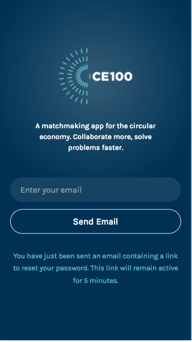

# ce100-app

[](https://travis-ci.org/emfoundation/ce100-app)
[](https://codecov.io/gh/emfoundation/ce100-app)
[](https://david-dm.org/emfoundation/ce100-app)
[](https://david-dm.org/emfoundation/ce100-app?type=dev)

**See [here](https://github.com/emfoundation/ce100-app/blob/master/technical.md) for the technical readme!**

A networking, knowledge sharing and collaboration platform for the Circular Economy 100 network, an Ellen MacArthur Foundation programme.

## _Why_?

To connect the members of the CE100!

## _Who_?

see: https://www.ellenmacarthurfoundation.org/ce100

## _What_?

A micro-social network focussed on connecting people in the Circular Economy.


## _How?_ (Implementation Notes)

This project uses the following technologies:

+ Node.js - https://nodejs.org/
+ Hapi.js - if you are new to Hapi or need a refresher, see: https://github.com/dwyl/learn-hapi
+ Redis - if you haven't used Redis before see: https://github.com/dwyl/learn-redis

### Running the Project Locally

Clone the GitHub Repository

```
git clone https://github.com/emfoundation/ce100-app.git
```

### Run & create the following Postgres Databases

```
//run database using
postgres -D /usr/local/var/postgres
//create the following databases
create database ce100;
create database ce100_test
```

### Run Redis
```
redis-server
```
Ensure you have the required `.env` file, then run:
```sh
npm i
npm start
```

### Required Environment Variables

If you are unsure what an Environment Variable is, see: https://github.com/dwyl/learn-environment-variables

create a file in the root of the project called `.env`

```sh
JWT_SECRET=
TEMPLATE_DIRECTORY=./server/email-templates
SENDER_EMAIL_ADDRESS=
AWS_REGION=eu-west-1
AWS_ACCESS_KEY_ID=
AWS_SECRET_ACCESS_KEY=
ROOT_URL=
S3_REGION=
S3_BUCKET=
```
_remember_ to add the appropriate _values_ to these keys.

> Note: if you are a team member ask Marie for the `.env` Google Doc!

### Running the Tests

To run the tests locally you will need to have a running Redis instance.
Then simply open a terminal window and type and run the following command:

```js
npm test
```

#### Executing a _Single_ Test

If you are attempting to _debug_ or _extend_ a single test,
you can _run_ a single test _file_ by executing it as node script. e.g:

```
node test/auth/auth.test.js
```

#### Adding/Updating Tags (Admin)

Please refer to the [admin guide](https://github.com/emfoundation/ce100-app/tags/admin-guide-add-edit-tags.md) for information on how add or update tags/categories.

#### HTTP/HTTPS (Admin)

Once the domain's HTTP/TCP protocol has been decided on, it might make sense to change ```isSecure: false``` on [line5 of server/auth.js](https://github.com/emfoundation/ce100-app/blob/master/server/auth.js#L5)

## Questions?

> If you have any questions, please raise an issue: https://github.com/emfoundation/ce100-app/issues

## Features

### Browse types of tag and tags
- ```/orgs/tags```
- ```/challenges/tags```
- ```/insights/tags```

Display all the tags by categories (or type of tags):


Clicking on a category will display the list of tags linked to this category:


Each tag is a link to the filter organisations or challenges pages


### Browse insights, organisations and challenges
- ```/orgs```
- ```/challenges```
- ```/insights```

Clicking on 'Explore' in the left side of the bottom-nav, will take you to a page where, by default, all orgs will be displayed.
Both active and inactive orgs/insights will be displayed to admin, but only active orgs and insights will be displayed to primary and secondary users.
This view displays only the organisation names; for more information, click on the name of an organisation, and you will be taken to their profile.


If the connected user is an admin the view displays on the left a green or red button which indicates if the organisation is active or inactive


To view and browse challenges or insights instead, click on the 'Challenges' or 'Insights' navigation option; this will take you to a page where all challenges/insights will be displayed.
Active and archived challenges from active organisations will be displayed to both admin and the primary user of a given organisation. *Secondary?*
Challenges will list the title and company it was shared by. Clicking on a challenge title will take the user to that challenge's view.


### Filter organisation and challenges by selected tag
- ```/orgs?tag=id_of_the_filter_tag```
- ```/challenges?tag=id_of_the_filter_tag```
- ```/insights?tag=id_of_the_filter_tag```


Selecting one of the tags from the browse tag view will filter the organisations or challenges depending on the type of the page the user is on. The list of organisations (or challenges) are all the items where the tag selected is also linked on:


If no organisations or challenges are linked to the selected tag the view will inform the user that no items have been found:


### Edit tags linked to an organisation
- ```/orgs/{idOrg}/tags```

This view allows a user to change the tags linked to an organisation by selecting or unselecting them.

Permissions: Only an admin and the primary user of the organisation can change the tags linked to the organisation.


### View all users
- ```/people```

Clicking on 'People' in the right side of the top-nav, will take you to a page where all users will be displayed.
Both active and inactive users will be displayed for admin, but only active users will show for primary users.


### Edit Challenge (Title, description, tags)
- ```/challenges/{id}/edit```

The title and description of a challenge can be edited. You must either be the primary user of the organisation or an admin to do this. If you have editing rights, you will see a 'pencil icon' at the top right corner of each challenge card. Clicking this will allow you to view your current challenge details, but also edit and submit an update on the challenge title and description.


### Admin adds a user
- ```/people/add```

Admins can create a new user by clicking on the `+ Add`. They can input details about the new user, upload a profile photo for them, select the user type, and 'link' them to an organisation.
The user types are admin, content-owners, primary and secondary. Admins and content-owners are not connected to organisations. An organisation can only have one primary user but can have as many secondary users as they wish.


### Edit a user
- ```/people/{id}/edit```

Primary users and admins have different scopes of editing permissions.
Primary users can only edit their profile. Admins can edit any user's profile.
Primary users can edit their `first name`, `last name`, `job title` and `phone`.
Admin users can also edit `email`.


### Archive/Unarchive challenges
- ```/challenges/{id}/toggle-archive```

Primary users and admins can make a challenge visible/invisible to other members of the platform by clicking on 'Archive/Unarchive Challenge', on editing your challenge.

### Archived challenges
- ```/orgs/{id}/archived-challenges```

Primary and secondary users can navigate to their organisation's archived challenges from their organisation's profile view, admins can do this for any organisation from the organisation profile:


Archived challenges are displayed in case the primary user or admin wants to unarchive and make them accessible to other members:


If there are no archived challenges:


### Activate Account
- ```/people/activate/{id}```

After a user is created by an admin, they will be sent an email with a link to the account activation page where the user has to create a password.


### Request password reset email
- `/password-reset`

From login or user settings, a user can request to change their password. They need to enter their email and will be sent a link to the reset password view. The link will only remain active for 5 minutes.




### Add new challenge
- ```/challenges/add```

A new challenge can be created on behalf of an existing organisation, by the primary user of that organisation.
Admins cannot create new challenges.
On clicking the 'Add Challenge' button in the centre of the bottom nav, users will be directed to a page to write the title, description and to add tags to a challenge. When they then click `Save & Publish` the challenge will be visible by other users.


### Insights (adding, editing, archiving and viewing)

- ```/insights ```
- ```/insights/add ```
- ```/insights/{id}/edit ```
- ```/insights/tags ```

Insights can only be created, edited and made archived/unarchived by admins. They can however be viewed by all users.


