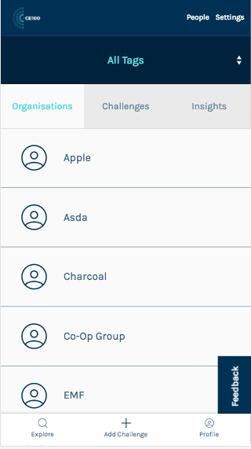
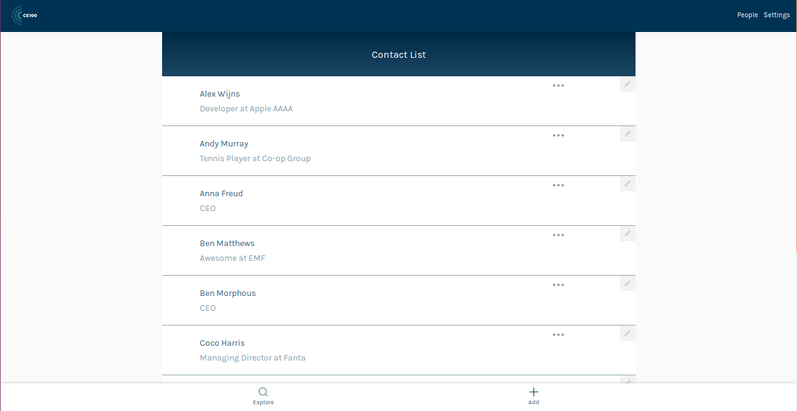

# ce100-app

[](https://travis-ci.org/emfoundation/ce100-app)
[](https://codecov.io/gh/emfoundation/ce100-app)
[](https://david-dm.org/emfoundation/ce100-app)
[](https://david-dm.org/emfoundation/ce100-app?type=dev)


A networking, knowledge sharing and collaboration platform for the Circular Economy 100 network, an Ellen MacArthur Foundation programme.

## _Why_?

To connect the members of the CE100!

## _Who_?

see: https://www.ellenmacarthurfoundation.org/ce100

## _What_?

A micro-social network focussed on connecting people in the Circular Economy.


## _How?_ (Implementation Notes)

This project uses the following technologies:

+ Node.js - https://nodejs.org/
+ Hapi.js - if you are new to Hapi or need a refresher, see: https://github.com/dwyl/learn-hapi
+ Redis - if you haven't used Redis before see: https://github.com/dwyl/learn-redis

### Running the Project Locally

Clone the GitHub Repository

```
git clone https://github.com/emfoundation/ce100-app.git
```
Ensure you have the required `.env` file, then run:

```sh
npm i
npm run generate-tags
npm start
```

### Required Environment Variables

If you are unsure what an Environment Variable is, see: https://github.com/dwyl/learn-environment-variables

create a file in the root of the project called `.env`

```sh
JWT_SECRET=
TEMPLATE_DIRECTORY=./server/email-templates
SENDER_EMAIL_ADDRESS=
AWS_REGION=eu-west-1
AWS_ACCESS_KEY_ID=
AWS_SECRET_ACCESS_KEY=
ROOT_URL=
```
_remember_ to add the appropriate _values_ to these keys.

> Note: if you are a team member ask Marie for the `.env` Google Doc!

### Running the Tests

To run the tests locally you will need to have a running Redis instance.
Then simply open a terminal window and type and run the following command:

```js
npm test
```

#### Executing a _Single_ Test

If you are attempting to _debug_ or _extend_ a single test,
you can _run_ a single test _file_ by executing it as node script. e.g:

```
node test/auth/auth.test.js
```

#### Adding/Updating Tags (Admin)

Please refer to the [wiki](https://github.com/emfoundation/ce100-app/wiki/Add-Update-Tags) for information on how to do this.

#### HTTP/HTTPS (Admin)

Once the domain's HTTP/TCP protocol has been decided on, it might make sense to change ```isSecure: false``` on [line5 of server/auth.js](https://github.com/emfoundation/ce100-app/blob/master/server/auth.js#L5)

## Questions?

> If you have any questions, please raise an issue: https://github.com/emfoundation/ce100-app/issues

## Features

### Browse types of tag and tags
- ```/orgs/tags```
- ```/challenges/tags```

Display all the tags by categories (or type of tags):


Clicking on a category will display the list of tags linked to this category:


Each tags is a link to the filter organisations or challenges pages


### Browse organisations and challenges
- ```/orgs```
- ```/challenges```

Clicking on 'Browse' in the left side of the bottom-nav, will take you to a page where, by default, all orgs will be displayed.
Both active and inactive orgs will be displayed to admin, but only active orgs will be displayed to primary users.
This view displays only the organisation names; for more information, click on the name of an organisation, and you will be taken to their profile.


To view and browse challenges instead, click on the 'Challenges' option; this will take you to a page where all challenges will be displayed.
Only active challenges, from active organisations will be displayed to both admin and primary user.
Challenges will list the title, full description and (if there are) any tags attached to the challenge.


### Filter organisation and challenges by selected tag
- ```/orgs?tag=id_of_the_filter_tag```
- ```/challenges?tag=id_of_the_filter_tag```

Selecting one of the tags from the browse tag view will filter the organisations or challenges depending on the type of the page the user is on. The list of organisation (or challenges) are all the item where the tag selected is also linked on:


If no organisations or challenges are linked to the selected tag the view will inform the user that no items have been found:


### Edit tags linked to an organisations
- ```/orgs/{idOrg}/tags```

This view allow a user to change the tags linked to an organisation by selecting or unselecting them

Permissions: Only an admin and the primary user of the organisation can change the tags linked to the organisation


### View all users
- ```/people```

Clicking on 'People' in the right side of the top-nav, will take you to a page where all users will be displayed.
Both active and inactive users will be displayed for admin, but only active users will show for primary users.
On the list, selected an individual user will toggle the user's contact details.


### Update Challenge (Title, Description)
- ```/challenges/{id}/edit```

The title and description of a challenge can be updated. You must however be the primary user of the organisation represented by the challenge (Admin are not allow to update challanges). If you have editting rights, you will see a 'pencil icon' at the top right corner of each challenge card. Clicking this will allow you to view your current challenge details, but also edit and submit an update on the challenge title and description.


### Admin adds a user
- ```/people/add```

Admin can add a new user by clicking on the `+` symbol. They can add some details about the new user, select the user type, and 'link' them to an organisation.
We only have user types of primary and admin at the moment, and there can only be one admin per organisation for now, so only organisations that do not have a primary user will show up in the drop-down list.  With the introduction of secondary users, or more than one primary per organisation, this will have to change.


### Edit a user
- ```/people/{id}/edit```

Primary users and admins have different scopes of editting permissions.
Primary users can only edit their profile. Admins can edit any user's profile.
Primary users can edit their `first name`, `last name`, `job title` and `phone`.
Admin users can also edit `email`.


### Archive/Unarchive challenges
- ```/challenges/{id}/toggle-archive```

You can make a challenge visible/invisible to other members of this platform by clicking on 'Archive/Unarchive Challenge', on editting your challenge.


### Activate Account
- ```/people/activate/{id}```

After a user is created by an admin, they will be sent an email with a link to the account activation page where the user has to create a password.


### Add new challenge
- ```/challenges/add```

A new challenge can be created on behalf of an existing organisation, by the primary user of that organisation.
Admin do not have the permission to create a new challenge.
On clicking the 'Add Challenge' button in the centre of the bottom nav, users will be directed to a page to write the title and description of the challenge. On clicking 'Next', the challenge will be saved, and made visible to the users.
Users will then be redirected to add tags to the challenge, so that other users can find challenges more easily.

