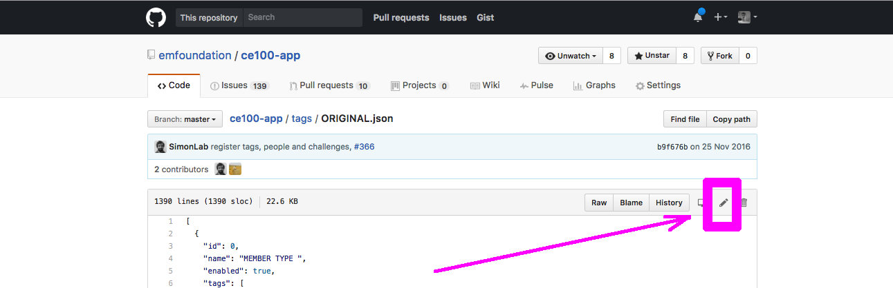
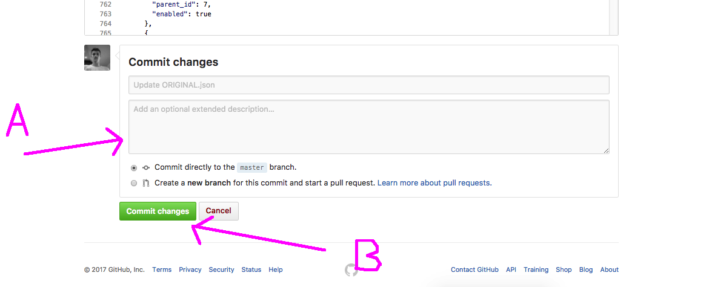

## ADMINS: Editing/deactivating tags and challenges

Contents of this guide:
- (How to edit a file on github)[How-to-edit-a-file]
- (How to save your changes)[Save-(commit)-the-changes]
- (How to update a category)[Updating-Categories]
- (How to update a tag)[Updating-Tag]
- (How to create a new category)[Adding-a-new-category]
- (How to create a new tag)[Adding-a-new-tag]

### How to edit a file

In either `/tags/tags.json` or `/tags/categories.json`, you can edit the contents of a file by clicking on the pencil icon highlighted here:



__________________

### Save (commit) the changes

- `A` - Once you have made the desired changes, you can add a commit message (eg: "Deactivate 'MEMBER TYPE' category")
- `B` - If you are happy with your changes and your message, the press the `Commit changes` button.



__________________

## Updating an existing tag or category


### Updating Categories
Here are the first 3 categories at the time of writing:

```js
[
  {
    "id": 1,
    "name": "BIOCYCLE ",
    "active": true
  },
  {
    "id": 2,
    "name": "BUSINESS ",
    "active": true
  },
  {
    "id": 3,
    "name": "BUILT ENVIRONMENT",
    "active": true
  },
```

Please:
- DO NOT touch the `"id"` of the category
- Feel free to change the name
- Feel free to choose the activity status of the category from `true` or `false`

So if I wanted to disable all the category called `BUSINESS` and all the tags associated with it:
```js
{
  "id": 2,
  "name": "BUSINESS ",
  "active": false
},
```

### Updating Tags

At the time of writing, the first 25 lines of the [`tags/tags.json`](https://github.com/emfoundation/ce100-app/tags/tags.json) file looks like this:

```js
[
  {
    "id": 1,
    "name": "Agriculture",
    "active": true,
    "categories": [
      1
    ]
  },
  {
    "id": 2,
    "name": "Anaerobic digestion",
    "active": true,
    "categories": [
      1
    ]
  },
  {
    "id": 3,
    "name": "Biochemical extraction",
    "active": true,
    "categories": [
      1
    ]
  },
```

The above snippet represents 3 different active tags (Agriculture, Anaerobic digestion and Biochemical extraction) all belonging to the same category with `id` of `1` (the BIOCYCLE category).

##### Again the main thing to know is you should not touch the `"id"` field

You may change:
- The name of the tag (rename/fix-spelling/change capitalisation)
- The activity status of that tag (`true` or `false`) - true would indicate the tag is active and should show up in the app
- The category that the tag belongs to (there may only be one category for each tag)


In order to change the category that a tag belongs to, you should first make sure you know the `id` of the category that you want the tag to belong to.  You can find the category `id` from the [`/tags/categories.json`](https://github.com/emfoundation/ce100-app/tags/categories.json) file.


So at the moment, the tag called `Agriculture` belongs to the category BIOCYCLE. If we wanted to change this to the BUILT ENVIRONMENT category, we would need the following in `tags/tags.json`:

```js
{
  "id": 1,
  "name": "Agriculture",
  "active": true,
  "categories": [
    3  
  ]
},
```

__________________

## Adding a new category

If you want to add a new category, head to the bottom of the list of categories, take note of the id of the last category, as we will need to increment this by 1 for our new category:

```js
  {
    "id": 12,
    "name": "TECHNICAL CYCLE ",
    "active": true
  },
  {
    "id": 13,
    "name": "TECHNOLOGY",
    "active": true
  },
  {
    "id": 14,
    "name": "LOCATION",
    "active": true
  }
]
```

Then, **not forgetting to add a comma to the end of the old list**, we can add in a new category with the new `id`:

```js
  {
    "id": 12,
    "name": "TECHNICAL CYCLE ",
    "active": true
  },
  {
    "id": 13,
    "name": "TECHNOLOGY",
    "active": true
  },
  {
    "id": 14,
    "name": "LOCATION",
    "active": true
  },
  {
    "id": 15,
    "name": "ABBA",
    "active": true
  }
]
```

We just created a new category called `ABBA` which will now appear at the top of the alphabetically sorted list of categories on the application (NOTE: LOCATION category will always appear at the bottom of the list at the request of the EMF team. Please contact a DWYL if you would like this to be changed.)


__________________

## Adding a new tag

Adding a new tag is similar to adding a new category. It is worth knowing the `id` of the category that you want to add to before starting this process. I will add a tag with the name `Isle of Wight` to the `LOCATION` category (with id of 14).

We always add new tags to the bottom of the list, regardless of which category they will belong to. Here is the bottom of the list of tags (note the last id of this list):

```js
  {
    "id": 143,
    "name": "UAE",
    "active": true,
    "categories": [
      14
    ]
  },
  {
    "id": 144,
    "name": "United Kingdom",
    "active": true,
    "categories": [
      14
    ]
  },
  {
    "id": 145,
    "name": "USA",
    "active": true,
    "categories": [
      14
    ]
  }
]
```

Then, **not forgetting to add a comma to the end of the old list**, we can add in a new tag with the new `id` and correct corresponding category `id`:


```js
  {
    "id": 143,
    "name": "UAE",
    "active": true,
    "categories": [
      14
    ]
  },
  {
    "id": 144,
    "name": "United Kingdom",
    "active": true,
    "categories": [
      14
    ]
  },
  {
    "id": 145,
    "name": "USA",
    "active": true,
    "categories": [
      14
    ]
  },
  {
    "id": 146,
    "name": "Isle of Wight",
    "active": true,
    "categories": [
      14
    ]
  }
]
```

Ensure:
- the new tag has a comma between it and the previous tag
- the `id` has been incremented by `1`
- the category `id` is correct
